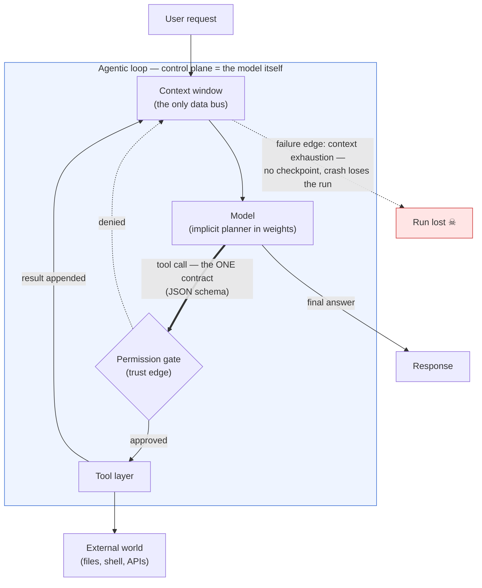
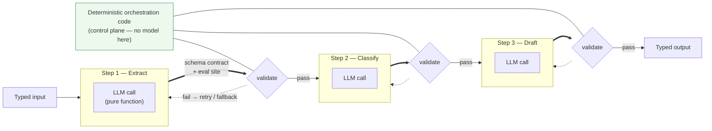
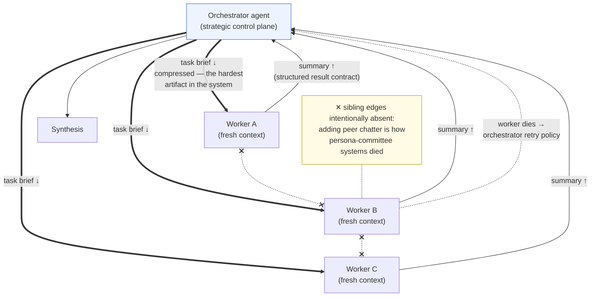
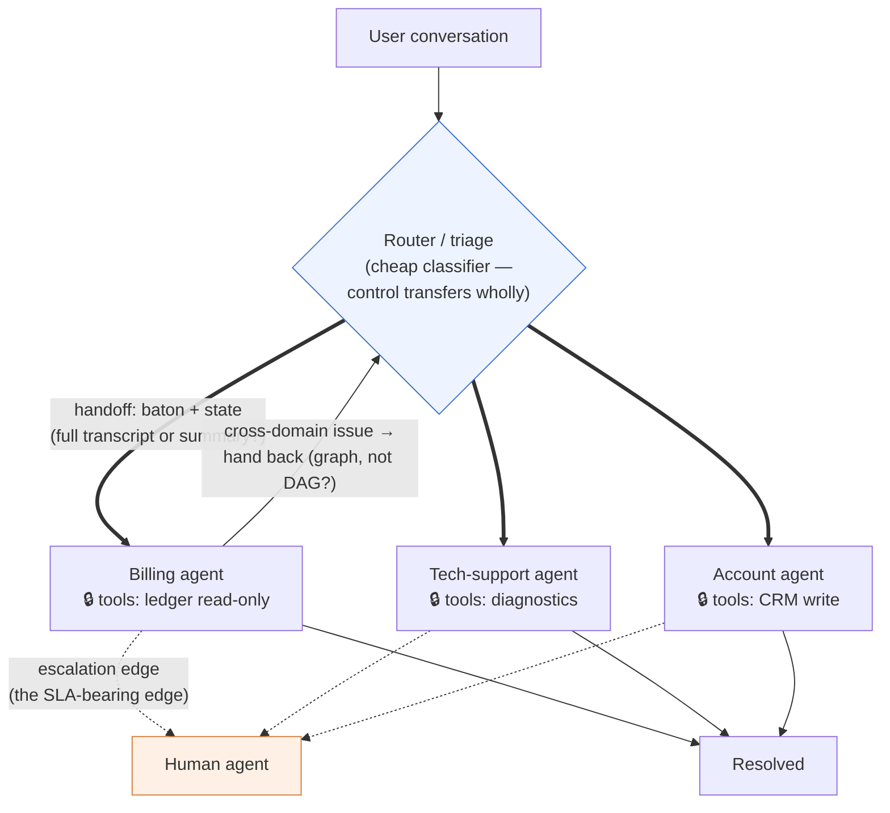
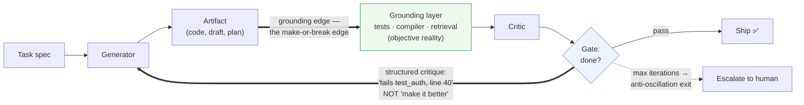
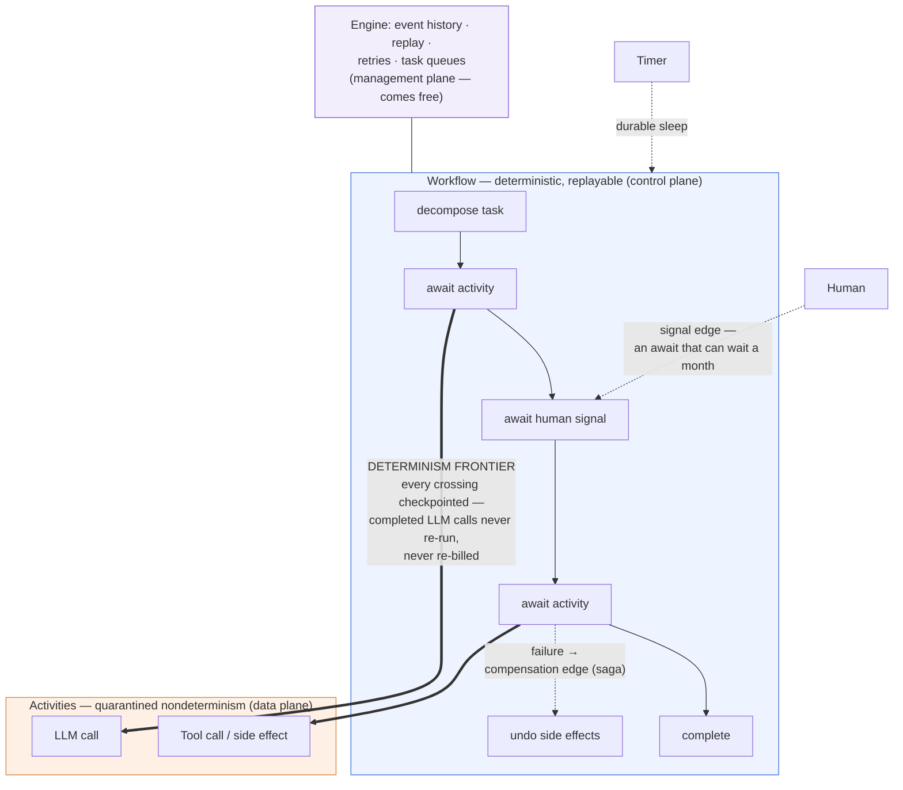
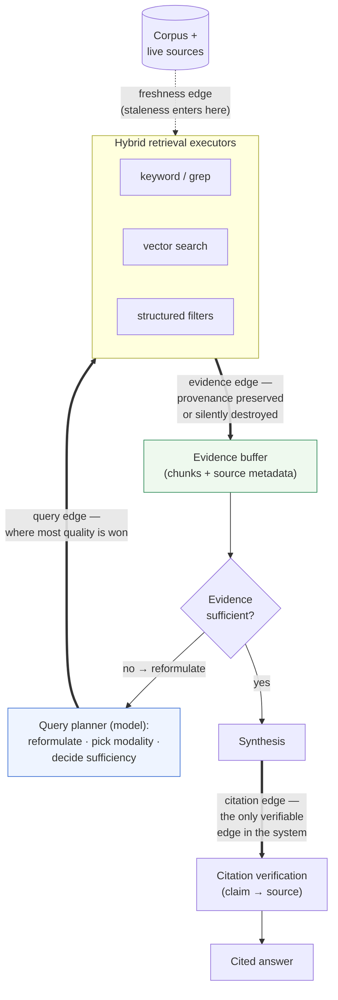
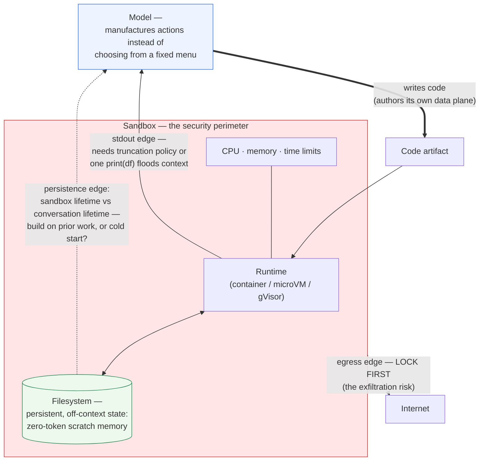
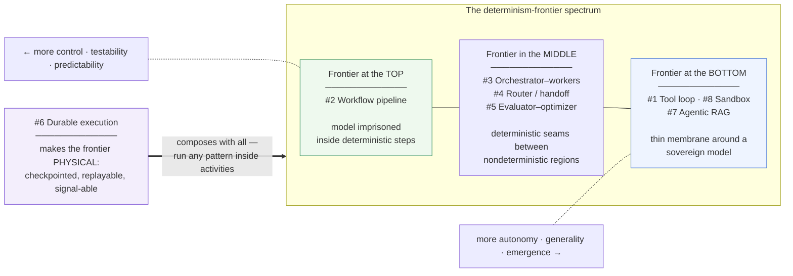

# Agentic Architectures — Visual Dissection

Eight production-proven agentic architectures, each drawn to expose its defining
feature: **where the control plane lives** and **which edge is load-bearing**.

**Visual conventions used throughout:**

| Notation | Meaning |
|---|---|
| `==>` thick edge | Load-bearing contract (the edge that makes or breaks the pattern) |
| `-.->` dashed edge | Trust / failure / escalation edge |
| `-->` solid edge | Ordinary data flow |
| Subgraph box | A plane or isolation boundary |

---

## 1. Single-Agent Tool Loop

*Control plane inside the model; the context window is the only data bus; one
contract (the tool schema); no checkpoint layer.*

**What to notice:** the deterministic membrane around the model is one gate
thick. Everything else — planning, memory, sequencing — is emergent inside
`LOOP`, which is why it's powerful and why it's unauditable.

---

## 2. Workflow-First Pipeline

*Control plane in code; the LLM is demoted to the data plane — a fuzzy pure
function inside a step. Every step boundary is a schema contract and an eval site.*

**What to notice:** the model appears only *inside* boxes, never *between*
them. The edges belong entirely to code — which is why this pattern is the
most testable and the most widely deployed in enterprises.

---

## 3. Orchestrator–Workers

*Split control plane: strategic in the orchestrator, tactical in each worker.
Edges carry compressed briefs and summaries, never raw context. Sibling edges
are deliberately absent.*

**What to notice:** context isolation *is* the architecture. If full
transcripts cross the down-edges, you've rebuilt pattern #1, expensively.

---

## 4. Router / Handoff

*A cheap triage classifier passes control wholly — a baton, not a committee.
Each handoff edge is simultaneously a state-transfer contract and a privilege
transition. The escalation edge carries the SLA.*

**What to notice:** every specialist is a narrow prompt+toolset bundle running
least-privilege — crossing an edge *changes what the system is allowed to do*.

---

## 5. Evaluator–Optimizer

*Control plane concentrated in one decision: the termination gate. The
grounding edge to objective reality is what separates working systems from
vibes-loops.*

**What to notice:** if `Grounding layer` is empty — the critic has nothing
external to check against — this loop quietly stops adding value after one
iteration.

---

## 6. Durable-Execution-Backed Agents (the temporal layer)

*The one architecture where the plane separation is physical and enforced.
The activity boundary is the determinism frontier made real: every crossing
is checkpointed, so crashes, deploys, and month-long waits are survivable.*

**What to notice:** any of the other seven patterns can run *inside* the
activity boxes — and inherit checkpointing, replay, and time. That's why this
composes with everything.

---

## 7. Agentic RAG

*The model controls retrieval strategy; the invariant is that provenance
metadata rides every hop, or citation becomes fiction at synthesis time.*

**What to notice:** three named edges (query, evidence, citation) carry all
the engineering. Production systems win by hybridizing the executors, not by
picking one.

---

## 8. Sandboxed Code Execution

*The model authors its own temporary data plane by writing programs. The
sandbox boundary is the security perimeter; the filesystem is persistent,
zero-token, off-context memory.*

**What to notice:** all three dashed/critical concerns (egress, stdout
truncation, persistence) sit *on the perimeter*, not inside it. The runtime
itself is a solved problem; the edges are where designs fail.

---

## Synthesis — Where Each Pattern Places the Determinism Frontier

Every architecture above is, at bottom, one decision: where does replayable
code end and nondeterministic model output begin?

**Design heuristic:** don't pick an architecture first. Decide where your task
can tolerate nondeterminism and where it can't, draw that edge — the
architecture falls out.

---

# Use Cases & Known Challenges

For each pattern: where it is seriously deployed (revenue-bearing, not demos),
and what is known to break in production.

## 1. Single-Agent Tool Loop

**Best-fit use cases**
- Software engineering agents: Claude Code, Cursor, Devin — the commercially strongest agent category to date.
- SRE/ops incident investigation: log-diving, hypothesis testing against live systems.
- Computer-use / browser automation for tasks too irregular to script.
- Expert-in-the-loop analysis where the task shape is unknown in advance.

**Fit signal:** open-ended task, hard to decompose up front, single working
session, an expert user nearby to steer and approve.

**Challenges / limitations / risks**
- **Context exhaustion:** long tasks outgrow the window; compaction loses detail at exactly the moment the task got complicated.
- **Compounding error:** each step conditions on prior steps — an early wrong assumption is reinforced, not corrected.
- **Prompt injection through tool results:** anything the agent reads (web page, file, email) is a potential instruction channel. This is the top security issue for the whole category.
- **No durability:** a crash or disconnect loses the run; there is no checkpoint layer.
- **Cost curve:** history is re-sent every turn — prompt caching mitigates but long sessions are expensive.
- **Unevaluable middle:** you can only test end-to-end; regression testing agent behavior is an unsolved practice.

## 2. Workflow-First Pipeline

**Best-fit use cases**
- Document processing at volume: claims intake, invoice extraction, KYC document review at banks/insurers.
- Content and localization pipelines with mandatory review gates.
- Triage/classification at scale (support tickets, leads, compliance alerts).
- Regulated environments where every step must be individually auditable.

**Fit signal:** you can draw the flowchart before seeing the input; volume is
high; per-step accuracy is measurable.

**Challenges / limitations / risks**
- **Distribution-shift brittleness:** anything off the flowchart fails silently or gets misfiled — the pattern has no capacity to improvise.
- **Flowchart sprawl:** each edge case adds a branch; two years in, the pipeline is unmaintainable and nobody dares refactor it.
- **Schema/model drift:** a model upgrade subtly changes output style, breaking downstream parsers that per-step evals don't catch.
- **Local evals, global failures:** every step can pass its eval while the end-to-end output is wrong.
- **Erosion temptation:** "just one agentic step" quietly destroys the determinism guarantees that justified the architecture.

## 3. Orchestrator–Workers

**Best-fit use cases**
- Deep research across many sources (Anthropic's Research feature — the publicly documented reference deployment).
- Large-scale code migration, audit, and review sweeps where the corpus exceeds any single context.
- Legal/M&A due diligence over data rooms; security audits over large estates.

**Fit signal:** the task decomposes into parallel, independent chunks whose
combined reading exceeds one context window.

**Challenges / limitations / risks**
- **Token multiplication:** Anthropic reported ~15× the tokens of a single chat — the pattern is only economical when the task justifies it.
- **Brief underspecification:** vague task briefs make workers duplicate effort or miss the point — the #1 practical failure.
- **Invisible worker error:** a confidently wrong summary flows upward and the orchestrator has no way to verify it — compounding without visibility.
- **Synthesis bottleneck:** the orchestrator's own context fills with summaries; very wide fan-outs need hierarchical synthesis.
- **Write conflicts:** parallel workers mutating shared files need worktree isolation or they corrupt each other.
- **Debuggability:** distributed traces across N agents are genuinely hard to follow.

## 4. Router / Handoff

**Best-fit use cases**
- Customer support at scale: Intercom Fin, Sierra, Decagon — the most economically validated agent category (deflection is directly measurable).
- IT service desks and internal helpdesks; insurance first-notice-of-loss; banking servicing chat.
- Any domain where compliance requires different privileges per intent.

**Fit signal:** high volume, a bounded and knowable intent taxonomy, measurable
resolution/deflection.

**Challenges / limitations / risks**
- **Misrouting cost:** the wrong specialist lacks the tools, the user repeats themselves, satisfaction craters.
- **State loss at handoffs:** summarized transfers drop the detail the next agent needed.
- **Ping-pong loops:** cross-domain issues bounce between specialists unless the topology explicitly handles them.
- **Taxonomy maintenance:** the intent long tail grows forever; the router decays without continuous retraining/evals.
- **Metric gaming:** "deflection" can count abandoned-in-frustration as success — measure resolution, not deflection.
- **Liability for confident wrong answers:** the Air Canada chatbot ruling set the precedent — the company owns what the agent says about policy and money.

## 5. Evaluator–Optimizer

**Best-fit use cases**
- Code review + auto-fix loops gated by tests/compilers (Graphite, CodeRabbit, CI-fixing agents).
- Contract clause verification against playbooks; regulated-copy compliance checking.
- Translation and content QA where a rubric or reference exists.

**Fit signal:** an objective grounding source exists — tests run, compilers
speak, documents can be cross-checked.

**Challenges / limitations / risks**
- **Reward hacking:** the generator learns to satisfy the critic, not the goal — deleting failing tests, special-casing inputs, verbose padding that flatters an LLM judge.
- **Shared blind spots:** same-model generator and critic miss the same errors; diversity of critics matters more than count.
- **Ungrounded plateau:** without objective grounding the loop stops adding value after one iteration while still charging for five.
- **Judge biases:** LLM-as-judge exhibits position, verbosity, and self-preference bias — known and measurable.
- **False proof:** a passing gate gets treated as verification; it is only absence of detected failure.
- **Cost/latency multiplication** per iteration; needs hard caps to prevent oscillation.

## 6. Durable-Execution-Backed Agents

**Best-fit use cases**
- Loan origination/underwriting, KYC onboarding, insurance claims lifecycle — days-to-weeks flows with human approvals mid-stream.
- Procurement and finance approval chains; infrastructure provisioning with rollback (saga).
- Any agentic flow touching money or records where "exactly once" and full audit history are non-negotiable.

**Fit signal:** long-running, human-in-the-loop, real side effects, audit
requirements.

**Challenges / limitations / risks**
- **Steep engineering model:** determinism constraints are alien to most teams (no wall-clock, no randomness in workflow code); violations surface as replay failures in production.
- **Versioning in-flight workflows:** a month-long workflow must survive deploys that change its own code, prompts, and models — the hardest operational problem in the pattern.
- **Payload limits:** event history isn't built for LLM-sized contexts — store references, not transcripts, or the engine buckles.
- **Infra burden or vendor lock-in:** self-hosting the engine is real ops work; cloud offerings trade that for coupling.
- **Durable ≠ correct:** the engine guarantees the decision executes exactly once — a wrong decision is now wrong, durably and at scale. Correctness must come from gates (#5) and humans (signals), not the substrate.

## 7. Agentic RAG

**Best-fit use cases**
- Enterprise knowledge search (Glean); legal research and diligence (Harvey, Robin AI); financial document intelligence (Hebbia).
- Deep-research products; customer-facing documentation Q&A; healthcare literature review.

**Fit signal:** answers must be grounded and cited across large,
heterogeneous, changing corpora.

**Challenges / limitations / risks**
- **Permission-aware retrieval:** leaking documents across ACLs is the #1 enterprise deployment blocker — permissions must be enforced at the retrieval layer, not the prompt.
- **Citation laundering:** the model cites a real source that doesn't actually support the claim; teams routinely skip the verification edge because it's expensive.
- **Corpus ceiling:** garbage or stale corpus in, confidently cited garbage out — index freshness is an operational discipline, not a feature.
- **Indirect prompt injection via retrieved content:** the corpus is an attack surface (poisoned documents instructing the agent).
- **Sufficiency misjudgment:** stops retrieving too early (shallow answer) or loops (cost blowout).
- **Evaluation difficulty:** no single ground truth; grounded-ness metrics are proxies.

## 8. Sandboxed Code Execution

**Best-fit use cases**
- Data analysis / BI copilots (every major BI vendor); quantitative research; spreadsheet and report automation.
- Scientific computing assistants; one-off ETL; and as the universal escape-hatch tool inside coding agents.

**Fit signal:** the action space is unbounded but computable — bespoke tools
can't be enumerated in advance.

**Challenges / limitations / risks**
- **Egress exfiltration:** allowed network paths (even package registries) are covert channels — lock egress before anything else.
- **Supply-chain risk:** the model pip-installing a typosquatted package is a real, observed attack vector.
- **Sandbox escape:** container isolation is not a security boundary against a determined payload — microVM/gVisor for untrusted workloads.
- **Resource abuse:** fork bombs, runaway loops, cryptomining — hard limits are mandatory.
- **Correctness illusion:** code that runs without error is mistaken for analysis that's right; silent dataframe errors (wrong join, dropped rows) are the classic failure.
- **State divergence:** the sandbox filesystem evolves off-context; the model's mental model of what files exist goes stale.
- **Environment mismatch:** works-in-sandbox, fails-in-prod for any code intended to leave the sandbox.

---

## Cross-Cutting Risk Register

Risks that apply to *all eight* and belong in every design review:

1. **Prompt injection** — any content the agent reads is an instruction channel (tool results, retrieved docs, emails). Mitigate at the tool/privilege layer, not the prompt.
2. **Excessive agency** — tools whose blast radius exceeds the task's needs. Least-privilege per agent/step; human gates before irreversible actions.
3. **Eval debt** — shipping without a regression harness; every prompt/model change is then a blind deploy.
4. **Cost observability** — token spend is the new cloud bill; per-run budgets and kill-switches are table stakes.
5. **Accountability** — the deploying organization owns the agent's outputs (legal precedent exists). Log everything; make the audit trail a first-class artifact — which is, not coincidentally, what pattern #6 gives you for free.
