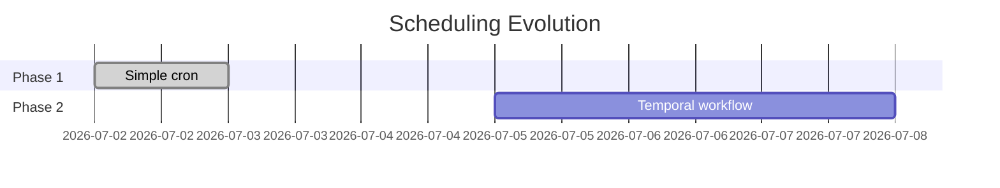

# ADR-005: Scheduling Strategy

## Status

**Accepted** - 2026-07-02

## Context

The email assistant needs to check emails periodically. Options:

1. **Simple cron** - System cron job
2. **Temporal cron** - Durable workflow scheduling
3. **Continuous loop** - Sleep between checks
4. **Webhook trigger** - Gmail push notifications

## Decision

Start with **simple cron (OS-level)** for walking skeleton. Migrate to **Temporal cron** for production.

## Rationale

### Phase 1: Simple Cron (Now)

```bash
# Check every 2 hours
0 */2 * * * cd /path/to/assistant-email && ./email-assistant
```

**Pros**:
- Zero code changes
- Easy to test
- Works immediately

**Cons**:
- No crash recovery
- No observability
- Manual deployment

### Phase 2: Temporal Cron (Future)

```go
workflowOptions := client.StartWorkflowOptions{
    ID:           "email-monitor",
    TaskQueue:    "email-agent",
    CronSchedule: "0 */2 * * *",
}
```

**Pros**:
- Crash recovery
- Built-in retries
- Full observability
- History tracking

**Cons**:
- Requires Temporal server
- More complexity

## Consequences

### Phase 1
- Quick to implement
- Easy to test manually
- Can run on any machine

### Phase 2
- Production-grade reliability
- Distributed execution
- Better monitoring

## Implementation Timeline



## Related Decisions

- ADR-003: Use Anthropic Claude Haiku

## Notes

Gmail push notifications (webhooks) require a public endpoint - not suitable for initial implementation.
