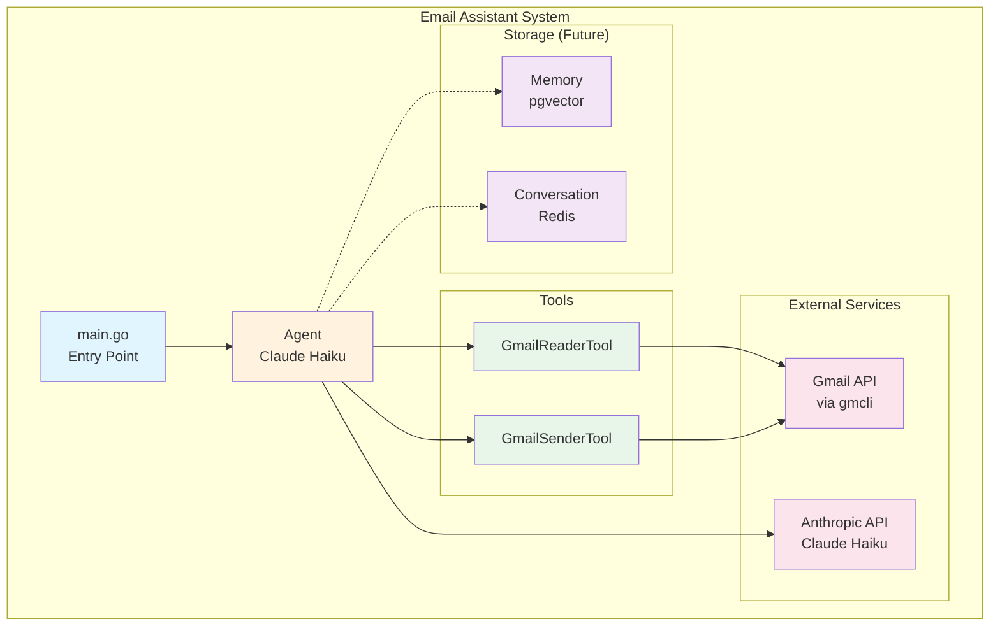
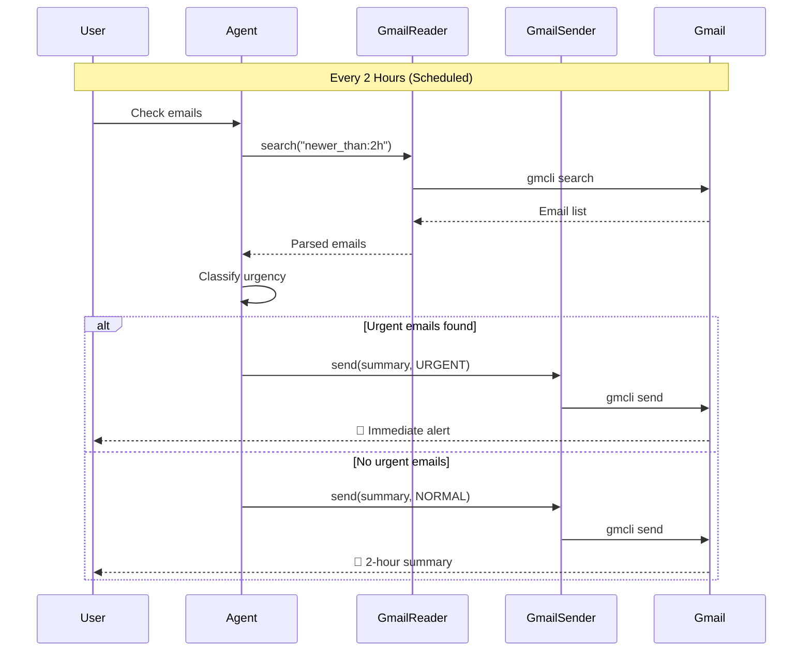
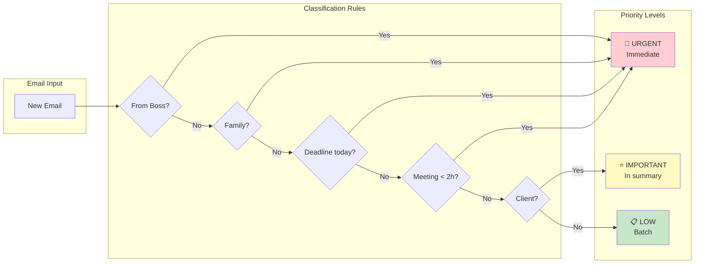
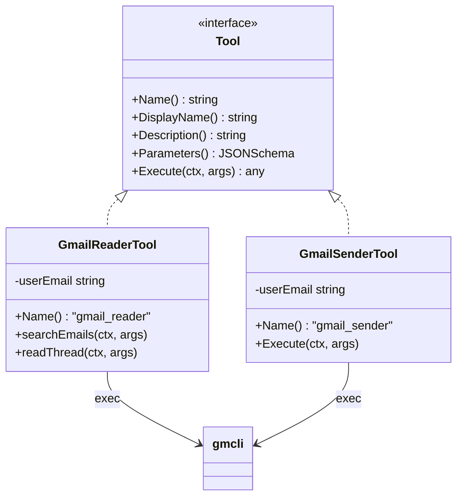
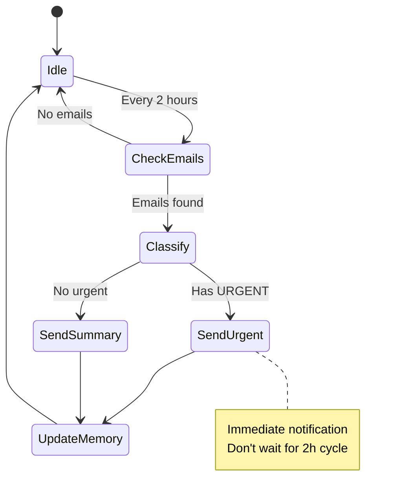
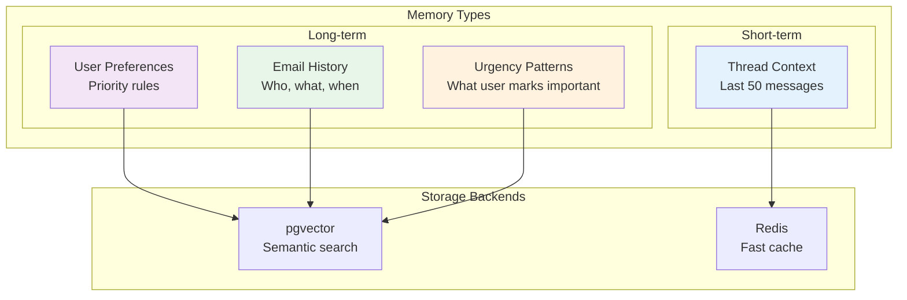
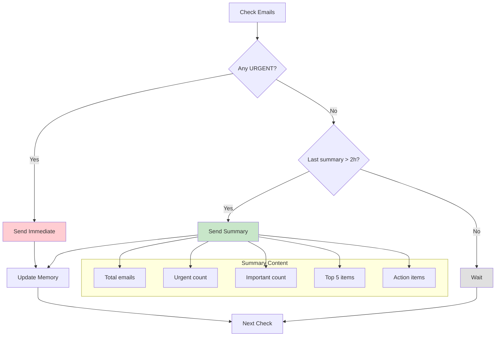
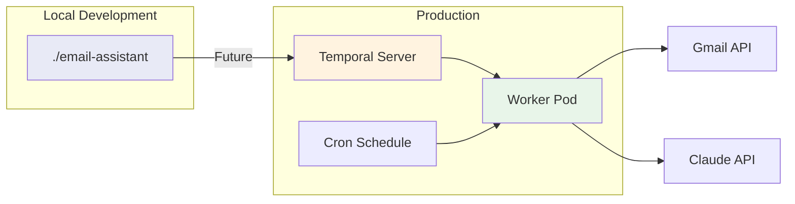
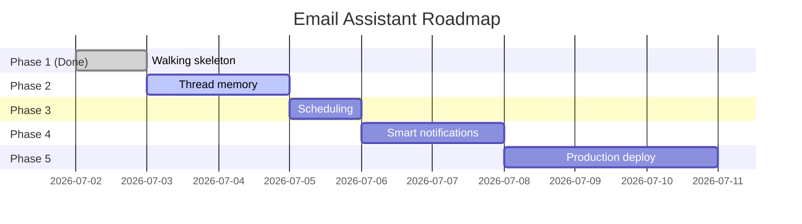

# Email Assistant - Project Brief

## Intention

Build a **personal email assistant** that:
1. Monitors inbox continuously
2. Classifies emails by urgency
3. Sends summaries every 2 hours
4. Alerts immediately for urgent emails
5. Preserves thread context for continuity

## Architecture Overview

## Core Flow

## Priority Classification

## Tool Architecture

## Scheduling Strategy

## Memory Architecture (Future)

## Notification Logic

## Deployment (Future)

## Configuration

| Setting | Value | Notes |
|---|---|---|
| LLM Model | claude-haiku-4-5 | Fast, cheap |
| Max Tokens | 50,000 | Per run budget |
| Max Iterations | 10 | Tool calls per run |
| Check Interval | 2 hours | Temporal cron |
| Quiet Hours | 22:00-07:00 | No notifications |

## Success Metrics

| Metric | Target | How to Measure |
|---|---|---|
| Response time | < 30s | Agent run duration |
| Accuracy | > 90% | User feedback |
| Token usage | < 50K/day | Anthropic dashboard |
| False positive | < 5% | Urgent classification |

## Risks & Mitigations

| Risk | Impact | Mitigation |
|---|---|---|
| Gmail API rate limit | High | Cache, batch requests |
| Token budget exceeded | Medium | MaxTokens limit |
| Wrong classification | Medium | Learn from corrections |
| Privacy concern | High | Local only, no cloud |

## Roadmap

